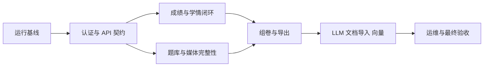

# 优化修复迭代计划

> 项目：初中数学题库与学情分析系统  
> 制定日期：2026-09-12  
> 依据：`AUDIT_REPORT.md`  
> 执行原则：先恢复正确性和核心闭环，再扩展功能

---
## 当前实施状态

R0 代码修复已完成，本地运行基线已通过；R1 认证、授权与 API 契约也已完成。

R0 完成内容：

- 同步 SQLModel Session 已统一；
- Alembic 可从空目录、空数据库升级到 head；
- sqlite-vec 已从基础迁移解耦，Embedding 使用可移植表持久化；
- 应用构造前会创建媒体、日志和导出目录；
- 后端 Dockerfile 已包含项目安装、迁移文件和启动前迁移；
- 前端 Dockerfile 已修复缺失 `public/` 和代理构建参数；
- Compose 已统一使用 `backend/.env`、容器内代理和 Python 健康检查；
- 已增加空库迁移及注册、登录、题目创建/读取回归测试。

R1 完成内容：

- OAuth2 Bearer access token 与 HttpOnly refresh cookie 会话；
- refresh token 轮换、重放拒绝、logout 与禁用用户会话撤销；
- 首个管理员初始化后关闭公开注册，用户管理仅管理员可用；
- 业务路由统一认证，班级/学生/作业和任务具备后端对象级权限；
- 新增 `ClassTeacher`、`AuthSession` 及 `0004_auth_and_class_access` 迁移；
- 主要请求和响应改为严格 Pydantic schema，可信操作者由服务端注入；
- 关键写操作和失败登录/后台任务写入 AuditLog；
- 前端移除 localStorage token，增加服务端会话恢复、页面守护和 401 自动刷新；
- ESLint flat config 已启用。

已实际通过：

- Alembic 空库升级及旧班主任关联回填，head 为 `0004_auth_and_class_access`；
- 后端 `pytest`：18 项通过；
- 后端基础 Ruff 检查通过；
- 实际服务 `/health`、注册关闭、登录、`/auth/me`、refresh 轮换和受保护 API；
- 前端 TypeScript、ESLint 和生产构建（14 个页面）；
- 实际浏览器登录、页面守护、刷新后会话恢复，控制台无异常；
- Compose YAML 结构解析（R0）。

用户已确认本地没有 Docker Engine。R0/R1 按本地开发链路验收并视为完成；Docker 配置保留为未来部署能力，不阻塞 R2。

---


## 1. 总体目标

通过连续修复迭代，将当前原型转换为满足以下条件的 MVP：

1. 本地环境可以从空数据库稳定启动；Docker 部署在具备运行环境时单独验收；
2. 管理员和教师必须登录，权限与数据范围符合 PRD；
3. 题目、试卷、班级、作业和成绩数据具有明确约束；
4. 每题成绩能够可靠聚合为学生和班级学情；
5. 智能组卷可以验证硬约束，并解释不可满足原因；
6. Markdown 和 Word 导出真实可用；
7. 核心业务闭环通过端到端 smoke 验证；
8. Roadmap 状态与可执行验收一致。

目标闭环：

```text
管理员初始化
  → 教师登录
  → 录入/导入题目
  → 关联知识点和媒体
  → 组卷并调整
  → 导出或下发作业
  → 录入每题成绩
  → 自动生成学生/班级学情
  → 基于薄弱点生成练习
  → 转为新作业
```

---

## 2. 执行规则

### 2.1 优先级

- P0：阻止启动、数据正确性、权限或核心闭环；必须先完成。
- P1：影响主要功能可信度和可维护性；MVP 验收前完成。
- P2：体验、性能和扩展能力；核心闭环稳定后处理。

### 2.2 完成定义

每个任务只有同时满足以下条件才可标记完成：

- 真实实现已提交，不是占位或 mock；
- 所有调用方迁移完成，无旧路径和兼容分支；
- 数据库迁移可从空库执行；
- 变更路径经过实际 smoke；
- 高风险算法具备行为级回归测试；
- OpenAPI、前端类型和文档同步；
- 无遗留 TODO、占位按钮或误导性勾选。

### 2.3 明确不做

修复期暂不开展：

- PDF/OCR 导入；
- AI 生成新题；
- 几何画板；
- 主观题 AI 判分；
- 多租户和学生端；
- 管理看板；
- AB 卷和历史卷相似度；
- Celery、Redis、微服务拆分。

---

## 3. 迭代 R0：恢复可运行基线

**优先级：P0**

### 3.1 数据库会话统一

决策：MVP 使用同步 SQLModel Session。

实施：

- 将 `create_async_engine`、`AsyncSessionLocal` 替换为同步 engine 和 Session 工厂；
- 数据库 CRUD 路由改为同步 `def`；
- 服务层统一接收同步 Session；
- LLM HTTP 调用保持 async；
- 后台任务状态写入使用独立同步 Session；
- 移除重复 commit：事务由请求或明确 application service 管理；
- SQLite 连接时启用 `PRAGMA foreign_keys=ON`；
- 配置 busy timeout，降低短时写锁失败。

### 3.2 迁移修复

- 修正 `alembic/env.py` 的模型导入；
- 以 `app.models` 统一注册 metadata；
- 从空 SQLite 文件执行 `upgrade head`；
- 对比 SQLModel metadata 与迁移 schema；
- 暂时将 sqlite-vec 迁移独立为可选能力，基础库不依赖扩展即可启动；
- 增加组合唯一约束和必要索引；
- 为已有开发数据库提供可重复执行的迁移路径。

### 3.3 启动与容器

- 在挂载 StaticFiles 前创建媒体目录，或设置安全的延迟检查；
- 后端镜像先复制 `app/` 再安装项目；
- 复制 Alembic 配置和迁移目录；
- 增加明确的容器迁移入口；
- 统一使用 `backend/.env` 或根目录标准 env 文件，删除 `.env-data` 分支；
- 将 `.env.example` 改为纯 dotenv；
- 健康检查改用 Python 标准库，或安装 curl；
- 前端不存在 `public/` 时不执行无效复制；
- 配置容器内 `API_PROXY_TARGET=http://backend:8000`；
- 确保生产环境不把后端地址硬编码为浏览器的 localhost。

### 3.4 验收

必须实际通过：

```text
1. 空数据目录启动后端
2. Alembic 从 base 升级到 head
3. GET /health 返回 200
4. 注册第一个管理员
5. 登录获得 token
6. 创建并读取一道题
7. 重启服务后数据仍存在
8. Docker Compose 从空卷启动前后端
```

交付物：可运行基线、迁移基线、容器启动链路。

---

## 4. 迭代 R1：认证、授权与 API 契约

**优先级：P0**
**状态：已完成（2026-09-13）**

### 4.1 认证依赖

新增统一依赖：

- `get_current_user`
- `require_admin`
- `require_teacher_or_admin`
- `require_class_access`
- `require_student_access`

要求：

- 校验 JWT 类型、过期时间、用户状态；
- `/auth/me` 返回当前用户；
- 除注册首个管理员和登录外，业务接口全部要求认证；
- 首个管理员创建后关闭公开注册；
- 新教师只能由管理员创建；
- `created_by`、`recorded_by`、审计用户从当前用户注入。

### 4.2 会话策略

优先选择同源 HttpOnly Cookie：

- 短期 access token；
- 可轮换 refresh token；
- SameSite 和 Secure 按环境配置；
- 前端不再以 localStorage 是否存在 token 作为授权依据。

如果继续 Bearer token，也必须实现 refresh、失效处理和完整路由保护。

### 4.3 Pydantic schema

为主要接口建立：

- `QuestionCreate/Update/Read`
- `KnowledgePointCreate/Update/Read`
- `PaperCreate/GenerateRequest/Read`
- `ClassCreate/Update/Read`
- `StudentCreate/Update/Read`
- `HomeworkCreate/Read`
- `HomeworkResultCreate/Read`
- `TaskRead`
- 结构化导入错误响应

禁止 PATCH 修改服务器字段和主键。

### 4.4 审计日志

记录以下写操作：

- 登录成功和失败；
- 用户创建、禁用、角色修改；
- 题目、试卷、作业、学生和班级变更；
- Excel 导入；
- 导出和后台任务失败。

### 4.5 验收

- 未登录访问业务接口返回 401；
- 教师访问非所属班级或学生返回 403/404；
- 教师不能访问用户管理；
- 客户端提交伪造 `created_by` 不生效；
- access token 过期后可以按会话策略恢复；
- OpenAPI 展示明确请求和响应 schema。

---

## 5. 迭代 R2：成绩明细与学情闭环

**优先级：P0**

### 5.1 数据模型重构

保留 `homework_results` 作为学生一次作业汇总，新增正规明细表：

```text
homework_question_results
- id
- homework_result_id
- paper_question_id
- question_id
- score
- max_score
- is_correct
- answer_text（可选）
- time_spent_seconds（可选）
- recorded_at
```

约束：

- `UNIQUE(homework_id, student_id)` 或等价汇总约束；
- `UNIQUE(homework_result_id, paper_question_id)`；
- score 范围必须为 `0 <= score <= max_score`；
- 汇总分和百分比由服务端从明细计算；
- 不信任客户端上传的知识点列表。

如需保证历史学情不受题目标签变更影响，增加作答时知识点快照关联表。

### 5.2 作业名单正规化

替换 `class_ids`、`student_ids` JSON：

- `homework_classes`
- `homework_students`

下发时保存学生名单快照，避免学生后续转班改变历史作业范围。

### 5.3 Excel 导入

- 模板列绑定 `paper_question_id`；
- 同时支持得分版和 `√/×` 对错版；
- 满分来自试卷快照；
- 校验姓名和学号是否一致；
- 返回结构化 `{row, column, code, message}` 错误；
- 定义重复导入为 upsert，并保证幂等；
- 单行错误不影响其他合法行，最终返回导入摘要。

### 5.4 学情计算

- 从每题结果关联 `question_knowledge`；
- 明确多知识点题目的权重规则；
- 计算累计正确率、最近 5 次正确率和趋势；
- 高难度或高分题权重必须归一化；
- 正确率恢复后自动解除薄弱点；
- 删除或更新已不再存在的聚合项；
- 录入或导入成绩后自动触发重算；
- 班级统计使用标准化百分比；
- 班级排行默认按指定作业，综合排行另设明确聚合算法。

### 5.5 前端

- 支持按题录入得分；
- 明确显示总分、满分和百分比；
- 展示 Excel 行列级错误；
- 删除手工逐学生调用重算的流程；
- 学情页面增加成绩趋势和知识点数据；
- 针对性练习可直接转为试卷或作业。

### 5.6 验收

构造一个学生、三个知识点、五次作业：

- 单题录入后汇总分正确；
- Excel 得分版与对错版导入结果一致；
- 重复导入不产生重复记录；
- 连续错误三次的知识点被标记为薄弱；
- 后续连续正确后薄弱点解除；
- 班级平均分、最高分、最低分和排行正确；
- 针对性练习命中薄弱知识点比例满足 PRD 验收要求。

---

## 6. 迭代 R3：题库、知识点与媒体完整性

**优先级：P1**

### 6.1 题目聚合写入

题目创建和编辑应在一个事务中处理：

- 题目主表；
- 选项；
- 小问；
- 多空答案与等价规则；
- 知识点关联；
- 媒体关联；
- checksum；
- 校对状态。

避免当前前端连续调用三个接口造成部分保存。

### 6.2 多空答案

- 前端支持多个空；
- 支持主答案、允许答案集合和匹配规则；
- 明确正则、数值误差和分数等价规则；
- 等价判断建立行为级测试。

### 6.3 知识点

- 明确统一知识点树，不按教材复制整棵树；
- 如需教材映射，新增教材章节映射表；
- 增加层级、循环引用和年级范围校验；
- 支持编辑、排序、软删、恢复和 JSON 导出；
- 禁止删除仍被题目使用的节点，或提供迁移目标。

### 6.4 媒体

- 新增题目媒体关联和解除接口；
- 引用计数由真实关联维护或查询计算；
- 未关联媒体引用数为 0；
- 文件写入和数据库关联失败时回滚并清理孤儿文件；
- 校验 MIME、扩展名、大小和真实图片格式；
- 媒体 URL 从请求/部署配置生成，不硬编码 localhost；
- 前端支持题干、选项和解析中的媒体位置与排序。

### 6.5 验收

- 一次请求可完整创建带小问、多空答案、知识点和图片的题目；
- 任一步失败不产生半成品；
- 相同文件只存一份但可关联多题；
- 解除最后一个关联后媒体可删除；
- 已出试卷继续读取原快照，不受原题修改影响。

---

## 7. 迭代 R4：智能组卷与导出

**优先级：P1**

### 7.1 约束模型

明确区分：

- 硬约束：题量、题型数量、必含/禁含知识点、无重复；
- 软约束：难度比例、时长、知识点均衡、相似度；
- 分值策略：按题型配置，或使用题目默认分值后归一化。

### 7.2 生成流程

拆为：

1. `plan`：统计各桶可用题量并预检；
2. `generate`：按硬约束选题；
3. `validate`：生成后复核；
4. `persist`：复核通过后保存快照。

要求：

- 所有选题全局去重；
- 候选不足时返回结构化原因；
- 必含知识点替换不得破坏其他硬约束；
- 支持固定随机种子，便于复现问题；
- 重新生成明确覆盖草稿或创建新版本；
- 前端支持替换、删除、排序和改单题分值。

### 7.3 MVP 导出

- Markdown：题面、选项、答案页、解析页、LaTeX；
- Word：题面、选项、图片、答案页和解析页；
- 暂不实现 PDF，保留第二批 Typst；
- 导出读取试卷快照，不读取实时题目内容；
- 文件生成后提供真实下载，不返回占位消息。

### 7.4 验收

- 构造满足和不满足约束的两组题库；
- 可满足时 10 次生成至少 9 次满足全部硬约束；
- 不可满足时不保存残缺试卷，并准确返回缺少的题型/难度/知识点；
- 试卷内无重复题；
- 分值总和等于设定总分；
- Markdown 和 Word 中公式、图片、答案和解析可读。

---

## 8. 迭代 R5：LLM、文档导入与向量能力

**优先级：P1/P2**

### 8.1 任务系统

- 路由仅创建任务，实际逻辑进入 application service；
- 任务状态支持 pending/running/success/partial_success/failed/cancelled；
- 更新真实进度；
- 启动时识别遗留 running 任务；
- 明确重试次数和退避；
- 记录 provider、模型和失败原因；
- 任务失败不能返回成功结果。

### 8.2 LLM provider

- 实现 MiniMax 主 provider；
- 仅在可重试网络/服务错误时切换 Ollama；
- JSON 解析错误单独处理；
- 输出必须通过 Pydantic schema 校验；
- 对部分成功返回具体失败分段；
- 对敏感学生数据规定不得发送或先脱敏。

### 8.3 文档导入边界

MVP 增补：

- Word 文本和表格提取；
- 5～10 题分段切题；
- 来源文件和页/题号追踪；
- 左原文、右结构化结果校对；
- 教师确认后批量入库。

第二批保留：

- PDF 文本解析；
- 扫描 PDF OCR；
- LaTeX OCR。

### 8.4 向量检索

在基础 MVP 稳定后启用：

- 明确 sqlite-vec 安装和加载方式；
- 没有扩展时基础系统仍可启动；
- 校验 embedding 维度；
- 题目确认入库后异步生成；
- 内容统一为“题干 + 答案 + 解析”；
- 提供相似题查询和重建索引命令；
- PostgreSQL 迁移时由独立 vector repository 替换实现。

### 8.5 验收

- MiniMax 不可用时符合条件的任务切换到 Ollama；
- 单段失败返回 partial_success，不丢失错误信息；
- 进程重启后遗留任务状态可恢复或明确失败；
- Word 导入结果可在校对页修改并入库；
- 相似题接口返回稳定、可解释的距离结果。

---

## 9. 迭代 R6：运维、验收与文档收口

**优先级：P1**

### 9.1 备份恢复

- SQLite 使用安全备份 API 或一致性快照，不直接复制写入中的文件；
- 媒体目录同步备份；
- 保留策略可配置；
- 记录备份结果；
- 提供恢复步骤；
- 实际执行一次恢复演练。

### 9.2 可观测性

- 健康检查区分存活与就绪；
- readiness 检查数据库和必要目录；
- 请求日志包含 request id、用户和耗时；
- 后台任务失败写入结构化日志；
- 禁止日志记录密码、token 和完整学生隐私字段。

### 9.3 最终验收

按 PRD 修订后的验收集执行：

- Docker Compose 空环境启动；
- 管理员和教师权限；
- 100 道含公式、图片和复合题的题库；
- 多条件检索；
- 智能组卷约束达标；
- Markdown/Word 导出；
- 班级和学生导入；
- 五次作业后的学情分析；
- 针对性出题命中率；
- 备份与恢复。

### 9.4 文档收口

- 修订 PRD 中冲突项；
- 更新架构 ADR；
- Roadmap 只保留通过验收的勾选项；
- 增加部署、备份恢复和已知问题文档；
- README 的启动命令必须由干净环境 smoke 验证。

---

## 10. 依赖顺序



不可调整的依赖：

- R0 本地运行基线已通过，当前直接进入 R1；
- R1 完成前不得宣称数据隔离；
- R2 完成前不得验收学情与针对性出题；
- R3 完成前不得验收含图片和多空答案的题库；
- R4 完成前不得宣称 MVP；
- R6 完成后才能恢复第二批 Roadmap。

---

## 11. 首个执行批次

立即执行范围：

1. 同步 Session 切换；
2. Alembic 导入与空库迁移修复；
3. sqlite-vec 从基础迁移中解耦；
4. StaticFiles 数据目录顺序修复；
5. Dockerfile、Compose 和 env 路径修复；
6. 建立启动 smoke；
7. 将 Roadmap 中基础架子状态改为验收制。

首批退出条件：

```text
空环境 → 迁移 → 启动 → 注册 → 登录 → 创建题目 → 查询题目 → 重启后读取
```

该本地链路已通过，下一执行阶段为 R1。
